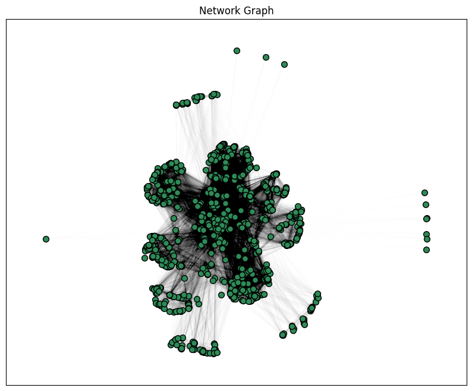
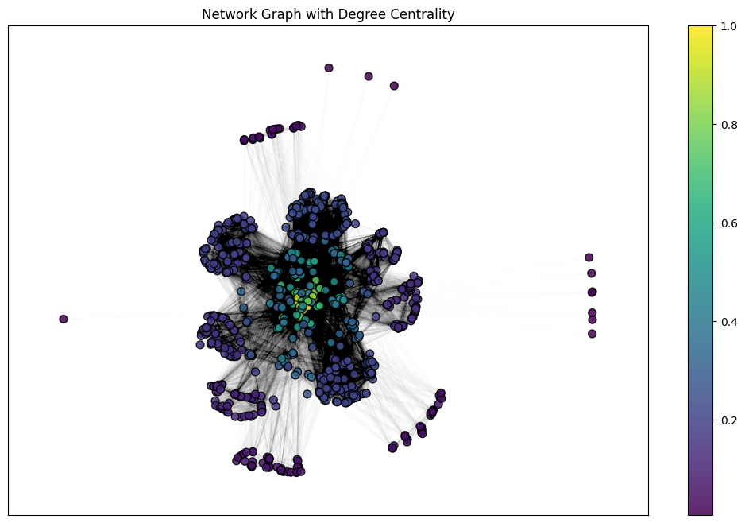
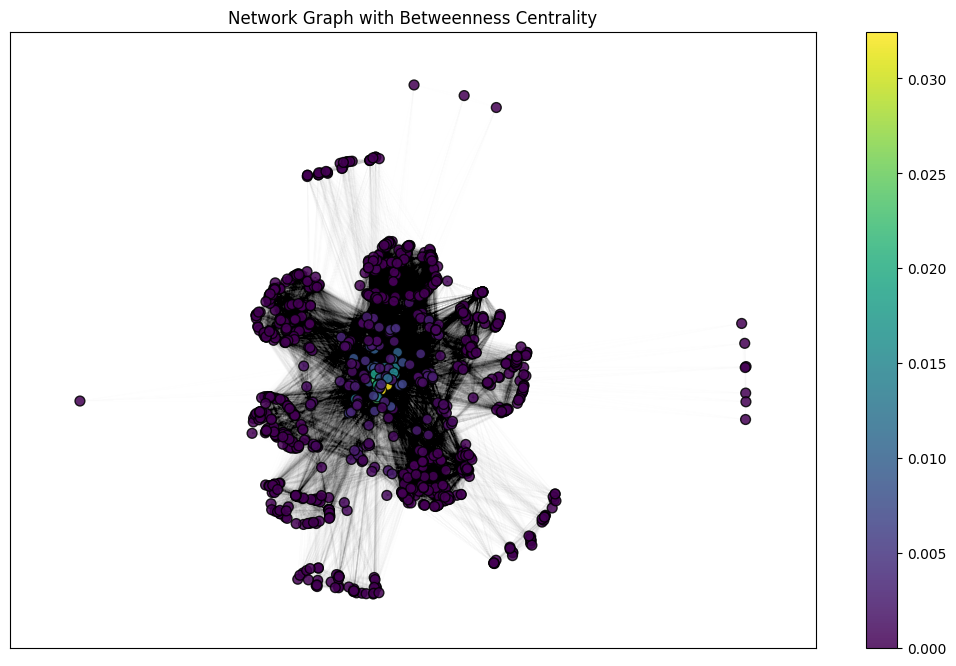
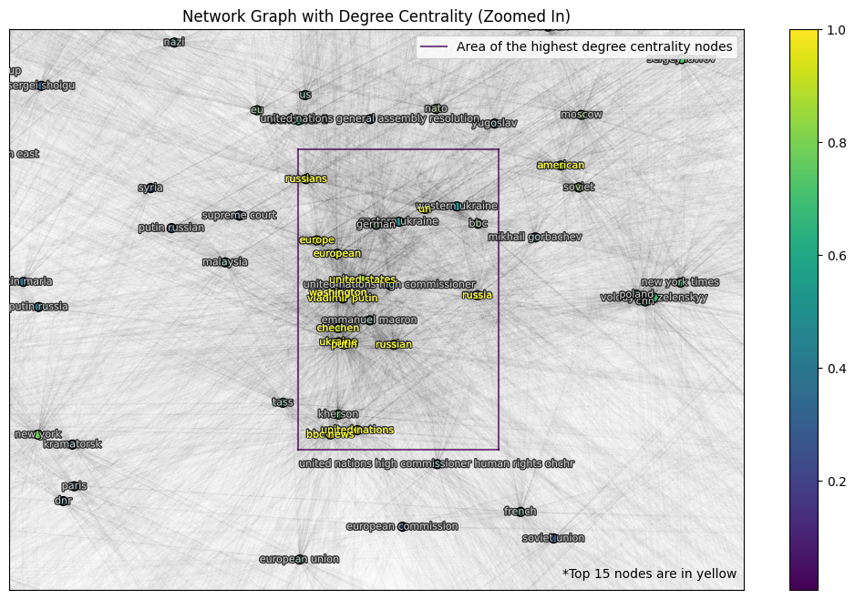
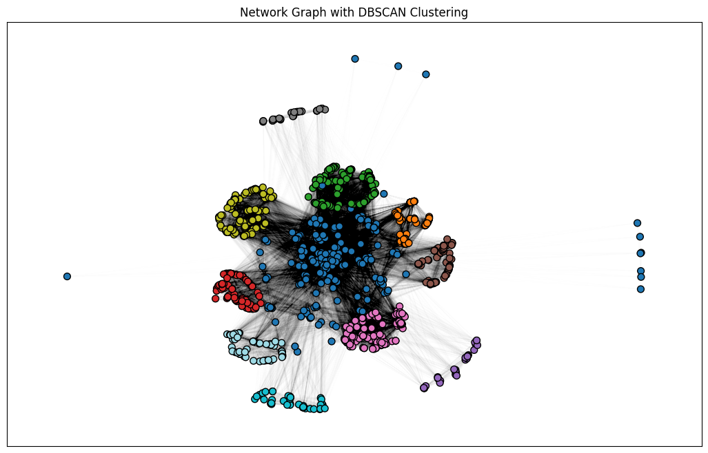
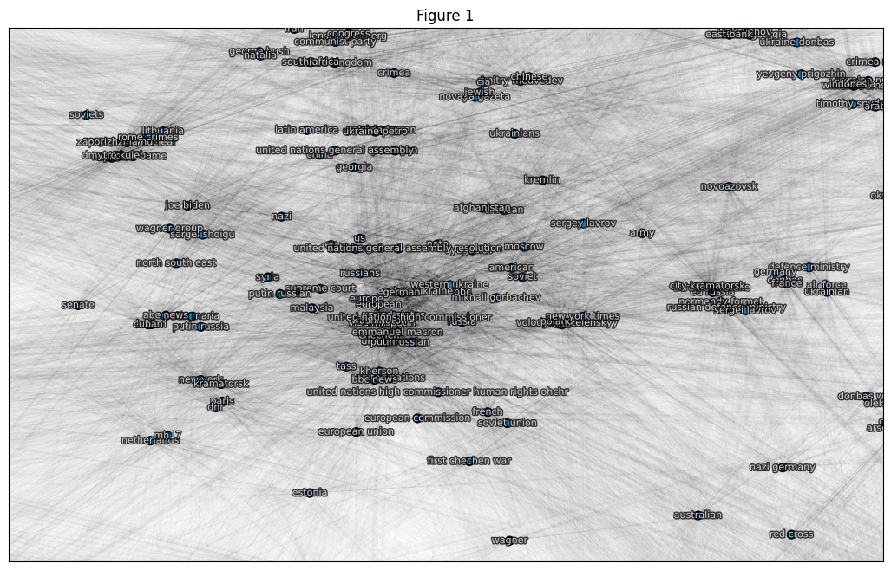
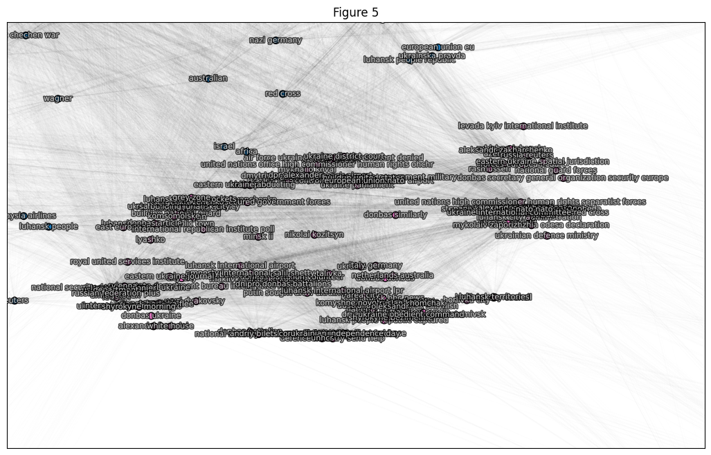

<!-- PROJECT LOGO -->
 

  

  <h3 align="center">AI Project #1: </h3>
  <h3 align="center">Web Scraping and Named Entity Recognition using Python</h3>

  

    by Illia Nesterenko
  

<!-- TABLE OF CONTENTS -->

  
Table of Contents

  <ol>
    <li>
      <a href="#-about-the-project">About The Project</a>
      <ul>
        <li><a href="#-built-with">Built With</a></li>
      </ul>
    </li>
    <li><a href="#-main-findings">Main Findings</a></li>
    <li><a href="#-contacts">Contacts</a></li>
  </ol>

<!-- ABOUT THE PROJECT -->
## 🔮 About The Project

This project grew from an academic assignment I had to do as a grad student. The goal is to _**explore how artificial intelligence can be applied to extract meaningful entities from vast textual data and establish connections between them**_. In short, I have extracted the named entities (e.g. "United Nations", "Macron" etc) from 13 Wikipedia articles on the topic of the Russo-Ukrainian war (<i>phase_1.ipynb for scrapping phase_2.ipynb for NER</i>). Then, I constructed a graph to visualize which entities were the most connected across the corpus (<i>phase_3.ipynb</i>). Finally, I ran several clusterization algorithms to group the words that are locally closer to each other (<i>phase_4.ipynb</i>). In the end, I compiled the whole code into a single file (<i>phase_5.ipynb</i>). Please, look at a corresponding Jupiter Notebook for a detailed walkthrough of each phase. For a summary, check <a href="#-main-findings">Main Findings</a>.

The repository also contains the names of the articles that were used in the projects (_articles.json_), the named entities extracted from the corpus (_data.csv_), the structure of a graph built from the entities (_graph.json_), and a Python script that scrapes the articles and performs NER in one go (_phase1-2.py_).

(<a href="#readme-top">back to top</a>)

### 🧰 Built With  
[![numpy]][numpy-url]  
[![pandas]][pandas-url]  
[![sklearn]][sklearn-url]  
[![matplotlib]][matplotlib-url]  
[![networkX]][networkX-url]  
[![nltk]][nltk-url]  
[![spacy]][spacy-url]  
[![requests]][requests-url]  
[![wikipediaapi]][wikipediaapi-url]  

(<a href="#readme-top">back to top</a>)

<!-- GETTING STARTED -->
## 🎓 Main Findings

After the whole web scraping and data preprocessing steps. I have constructed the following graph:

  

I analysed it in two ways:

### **1. Using graph analysis metrics (degree and betweenness centality):**

  
  

From these pictures, we can see something that it implicitly declared during graph construction: the more interconnected the nodes are the stronger their "gravity force". In other words, the most important (according to the metrics) nodes are in the center. 

  

When taking a closer look at the most interconnected points, we can spot an interesting observation. We see that the center of the discourse is constituted from a vocabulary that includes names of states, nations, cities, continents ('ukraine', 'russia', 'russian', 'united states', 'washington','chechen', 'europe', 'european'), international organisations ('united nations', 'un'), and even news outlets ('bbc news'). The striking thing is that among the most interconnected nodes, the only person to be in the list is _vladimir putin_ ('putin'). We didn't find in the list Ukrainian, American or EU member-states leaders. However, I must note that this observation is qualitative and acts more as a "fun fact" than a "hard proof".

### **2. Using clustering algorithms**
As we saw in the previous point, the location of the nodes seems to be meaningful. So, we can try to exploit that and divide nodes into groups. I've experimented with different algorithms (see phase_4.ipynb for full discussion) and arrived at the conclusion that the best one to use is **DBSCAN**:

  

The algorithm divided the nide into 13 groups. Below are examples from group 1 (center of the graph, dark blue on the clustering figure) and group 5 (lower left on the graph, pink on the clustering figure) named "Figure 1" and "Figure 5" correspondingly:

  
  

The first group is the center that we discussed earlier. But the next group shows us a lot of repeated entities. It seems that spacy's NER model created a lot of near-duplicates that weren't apparent when looking at the table with extracted entities. Yet these near-dupes are specific enough to appear only in one group. This means that the groups are most likely organized around the entities from documents they were extracted and that the repeating entities were pulled from their groups closer to the center. This would explain why the density of the core of the graph is much lower than that of the groups. So, it seems that we built a "map" that shows us from which document the entity is most likely to be from!

(<a href="#readme-top">back to top</a>)

<!-- CONTACT -->
## ☎️ Contacts

Illia Nesterenko - [Telegram](https://t.me/illia_nest) - [LinkedIn](https://www.linkedin.com/in/illianest/) - illia.nest03@gmail.com

Project Link: [https://github.com/illia-nest/web-scrapping-and-ner](https://github.com/illia-nest/web-scrapping-and-ner)

(<a href="#readme-top">back to top</a>)

<!-- MARKDOWN LINKS & IMAGES -->
[requests]: https://img.shields.io/badge/requests-gray?style=for-the-badge
[requests-url]: https://requests.readthedocs.io
[wikipediaapi]: https://img.shields.io/badge/wikipedia--api-brown?style=for-the-badge
[wikipediaapi-url]: https://pypi.org/project/Wikipedia-API/
[nltk]: https://img.shields.io/badge/nltk-darkgreen?style=for-the-badge
[nltk-url]: https://nltk.org/
[spacy]: https://img.shields.io/badge/spacy-blue?style=for-the-badge
[spacy-url]: https://spacy.io/
[NetworkX]: https://img.shields.io/badge/networkx-purple?style=for-the-badge
[NetworkX-url]: https://networkx.org/
[numpy]: https://img.shields.io/badge/numpy-%23013343?style=for-the-badge&logo=numpy
[numpy-url]: https://numpy.org/
[pandas]: https://img.shields.io/badge/pandas-%23130654?style=for-the-badge&logo=pandas
[pandas-url]: https://pandas.pydata.org/
[matplotlib]: https://img.shields.io/badge/matplotlib-%230060df?style=for-the-badge&logo=matplotlib
[matplotlib-url]: https://matplotlib.org/
[sklearn]: https://img.shields.io/badge/scikit--learn-%23223228?style=for-the-badge&logo=scikitlearn
[sklearn-url]: https://scikit-learn..org/
